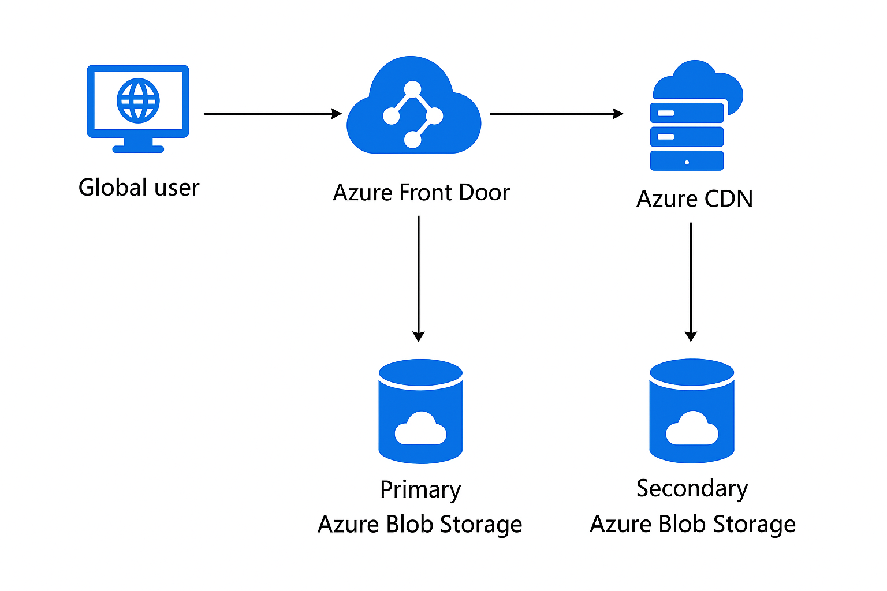

# Azure Global Static Website (AFD + CDN + Blob Static Website)

This project deploys a production‑grade global static site using two regions. Front Door provides global anycast, health probes, and failover between two CDN endpoints, each backed by a regionally hosted static website in Blob Storage.

## What you get
- 2 x Storage Accounts (Static Website enabled; versioning+change feed enabled for optional replication)
- Optional blob Object Replication from primary `$web` to secondary `$web`
- 1 x Azure CDN profile with two endpoints (primary + secondary)
- 1 x Azure Front Door profile + endpoint + origin group (priority routing) + route

## Prerequisites
- Terraform v1.5+
- Azure subscription permissions to create networking + CDN + Front Door + Storage
- Azure CLI logged in (`az login`) if you use CLI-based auth for the provider

## Quick start
```bash
# 1) Copy variables template and edit
cp terraform.tfvars.example terraform.tfvars

# 2) Initialize & plan
terraform init
terraform plan

# 3) Apply
terraform apply -auto-approve

# 4) Upload your site content
#   Upload index.html, 404.html and assets to the PRIMARY storage account's $web container.
#   Replication (if enabled) will copy to secondary.

# 5) Test
#   Get the Front Door default hostname from outputs and open it in the browser.